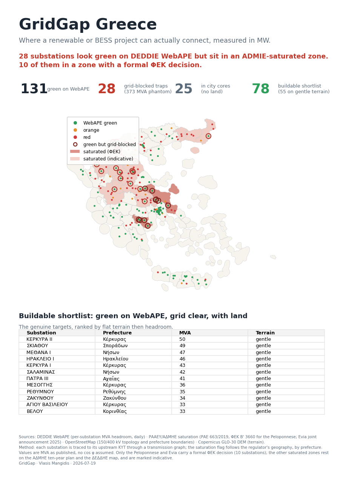

# GridGap — Grid connection intelligence for Greek renewables

GridGap maps, per substation in Greece, **where a renewable / BESS project can actually connect** — in MW — by joining two datasets that nobody else combines.



## The problem

The Greek distribution operator **ΔΕΔΔΗΕ (DEDDIE)** publishes daily RES hosting-capacity
margins per substation and HV/MV transformer at
[apps.deddie.gr/WebAPE](https://apps.deddie.gr/WebAPE/). But its own terms state that
**constraints from the transmission system are not taken into account**.

So a substation can show 40 MW free and be **impossible** to connect, because it sits
downstream of a saturated **ΑΔΜΗΕ (IPTO)** transmission grid. DEDDIE shows the green.
ΑΔΜΗΕ is where the real blockage sits. Almost nobody looks at both at once.

**Product = ΔΕΔΔΗΕ ⊕ ΑΔΜΗΕ ⊕ land constraints, on one map.**

## Key result (2026-07 snapshot)

Starting from 229 substations that DEDDIE covers:

| 131 | 28 | 25 | **78 (55 gentle terrain)** |
|---|---|---|---|
| green on WebAPE | **grid-blocked traps** (10 with a formal ΦΕΚ decision) | in dense city cores (no land) | **buildable shortlist** |

**28 substations look green on WebAPE but sit in an ΑΔΜΗΕ-saturated zone** — phantom
capacity a developer could chase for months. Conversely, **55 substations are genuinely
buildable** (green + free grid + land + gentle terrain): the shortlist worth a phone call.

## How it works

Each DEDDIE 150/20 kV substation is traced to its upstream **ΚΥΤ** (400/150 kV centre)
through a transmission graph built from OpenStreetMap, then cross-referenced with the
regulator's saturation geography and with terrain from the Copernicus DEM.

A key modelling finding: transmission saturation is declared by the regulator **per
prefecture / zone** (e.g. "downstream of ΚΥΤ Κουμουνδούρου" = the whole Peloponnese
network), not per nearest ΚΥΤ — so the saturation flag follows the regulator's own
geography, with the ΚΥΤ topology used as corroboration.

## Pipeline (run order)

| Step | Script | Does |
|---|---|---|
| 1 | `fetch.py` | Pull DEDDIE WebAPE margins (daily) → `data/raw/margins_YYYY-MM-DD.json` |
| 2 | `validate.py` | Reverse-engineer the WebAPE availability icon: `min(thermal, short-circuit)` reproduces it (~98%) |
| 3 | `osm_fetch.py` | Pull the Greek transmission network (400/150 kV lines + substations) via Overpass |
| 4 | `boundaries_fetch.py` | Pull Greek prefecture boundaries (OSM `admin_level=6`) |
| 5 | `build_topology.py` | Build the power-line graph, bridge lines through substations, trace each substation to its upstream ΚΥΤ |
| 6 | `join_saturation.py` | Join topology + `data/saturation_zones.json` → `data/substations.geojson` |
| 7 | `land_slope.py` | Add terrain slope from the Copernicus GLO-30 DEM (windowed COG reads) |
| 8 | `make_story.py` | Build the interactive dashboard (`gridgap_story.html` / `gridgap_map.html`) |
| 9 | `make_onepager.py` | Build the one-page PDF (`GridGap_Greece.pdf`) |

`discover.py` is the original Playwright reverse-engineering of the WebAPE endpoint;
`make_map.py` (folium) and `make_plotly.py` are alternative renderers.

## Quick start

```bash
pip install -r requirements.txt
python -m playwright install chromium        # only for discover.py

python fetch.py                # DEDDIE margins
python osm_fetch.py            # transmission network
python boundaries_fetch.py     # prefectures
python build_topology.py       # substation -> upstream ΚΥΤ
python join_saturation.py      # -> data/substations.geojson
python land_slope.py           # terrain
python make_story.py           # interactive dashboard
python make_onepager.py        # PDF
```

## Data sources

- **ΔΕΔΔΗΕ WebAPE** — per-substation MVA hosting-capacity margins (daily, open REST endpoint)
- **ΡΑΑΕΥ / ΑΔΜΗΕ** — transmission saturation (ΡΑΕ 663/2019, ΦΕΚ Β' 3660 for the Peloponnese;
  Evia; ΑΔΜΗΕ ten-year plan for the indicative zones) — curated in `data/saturation_zones.json`
- **OpenStreetMap** — 150/400 kV topology, substations, prefecture boundaries
- **Copernicus GLO-30 DEM** — terrain slope

## Honest notes

- Values are **MVA as published** — no cos φ is assumed, so we do not silently convert to MW.
- Only the **Peloponnese and Evia** carry a formal ΦΕΚ saturation decision; the other zones
  rest on the ΑΔΜΗΕ ten-year plan and the DEDDIE saturated-networks map, and are marked **indicative**.
- Terrain is the first land layer; **Natura 2000 and CORINE land-cover are the next** and are
  not yet included.
- The daily `fetch.py` archive is the moat: DEDDIE updates daily and keeps no history anywhere.

## Tech stack

Python · geopandas · shapely · networkx · rasterio · plotly · matplotlib · playwright · pandas

## Author

**Vlasis Mangidis** — geospatial data scientist ([github.com/vlasismangidis8](https://github.com/vlasismangidis8))
